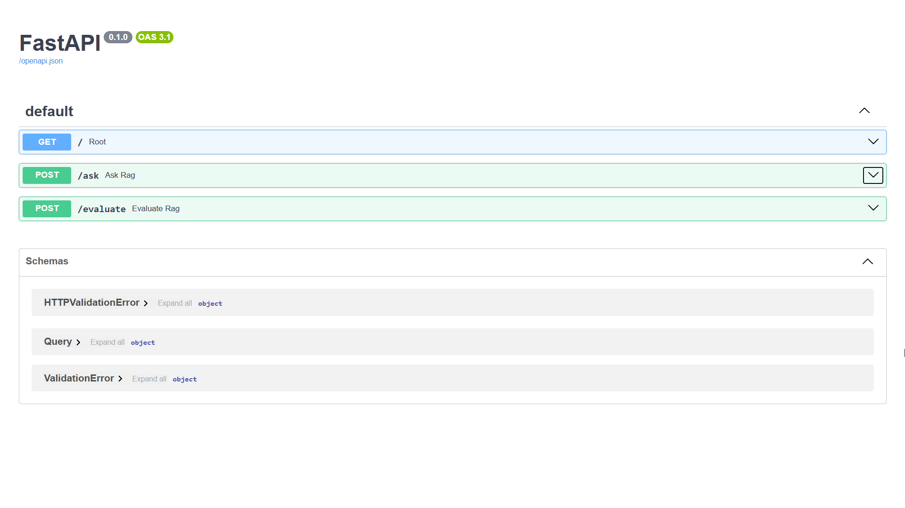
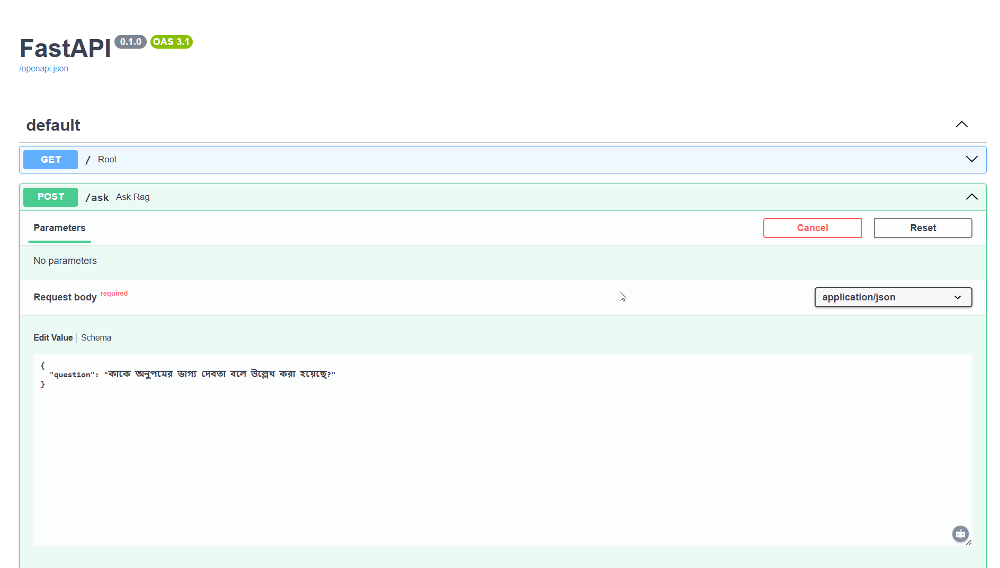
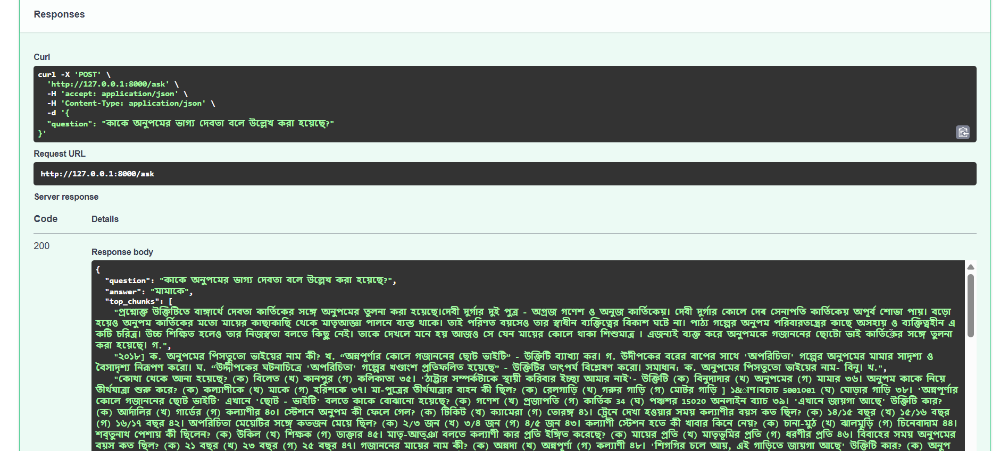
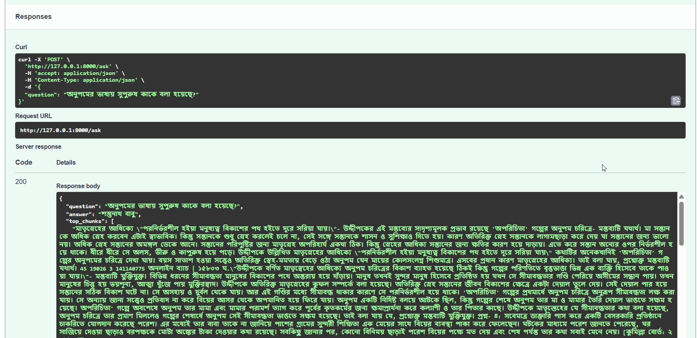
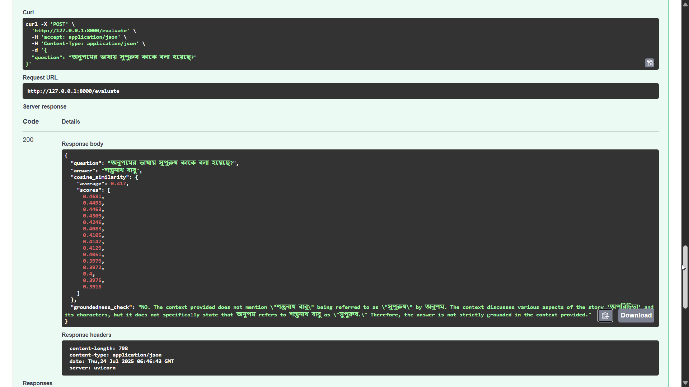
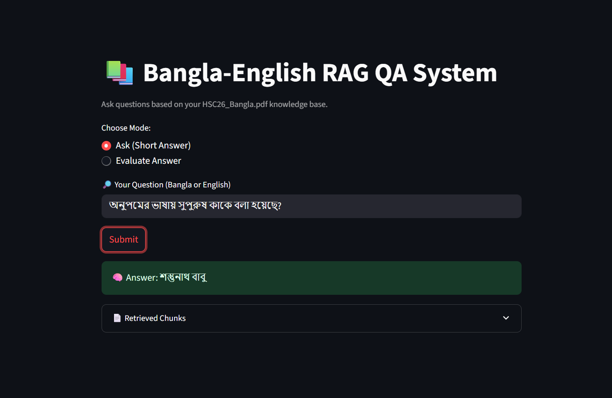

# Developed a Simple Multilingual Retrieval-Augmented Generation (RAG) System
Design and implement a basic RAG pipeline capable of understanding and responding to both English and Bengali queries.

## 📦 Directory Structure
```
├── app.py # FastAPI backend
├── build_vector_index.py # Embeds and stores vector data using FAISS
├── pdf_extractor.py # Extracts and preprocesses text from PDF
├── rag_ui.py # Extracts and preprocesses text from PDF
├── index/
│ ├── faiss_index.idx # Vector index
│ └── valid_chunks.pkl # Serialized document chunks
├── myenv #virtual environment
├── .env # OpenAI API Key
├── data/
│ ├── cleaned_text.txt 
│ └── HSC26_Bangla.pdf 
└──.gitignore
```

## 🚀 Setup Instructions

**Step 1: Clone the Repository and Set Up Environment**
```
git clone https://github.com/md-marop-hossain/Multilingual-Retrieval-Augmented-Generation-RAG-System.git
cd Multilingual-Retrieval-Augmented-Generation-RAG-System
python -m venv myenv
source myenv/bin/activate  # or myenv\Scripts\activate on Windows
pip install -r requirements.txt
```
**Step 2: Extract Text from PDF**

Run the following command to extract text from the PDF using ```pdf_extractor.py```:
   
```python pdf_extractor.py```

**Step 3: Build Vector Index**

This step includes chunking, embedding, and creating the vector store:

```python build_vector_index.py```

**Step 4: Launch the FastAPI Server**

Start the FastAPI app using:

```uvicorn app:app --reload```

 **Available API Endpoints:**
   - Ask a question : ```POST http://127.0.0.1:8000/ask```
   - Evaluate the system : ```POST http://127.0.0.1:8000/evaluate```
   
**Step 5: Start the Streamlit UI**

```streamlit run rag_ui.py```

## 🛠️ Tools & Libraries Used

| Category              | Tool/Library           | Purpose                                                                 |
|-----------------------|------------------------|-------------------------------------------------------------------------|
| LLM & Embeddings      | OpenAI GPT-4o          | Generates grounded answers from retrieved context                       |
|                       | text-embedding-3-large | Multilingual, high-quality embeddings for semantic chunk comparison     |
| Vector Store          | FAISS                  | Fast Approximate Nearest Neighbor search over dense vector space        |
| Backend Framework     | FastAPI                | Backend API for handling queries, answers, and evaluations              |
| Frontend Interface    | Streamlit              | Provides a user-friendly web UI for interacting with the RAG system     |
| PDF Text Extraction   | PyMuPDF (fitz)         | Extracts formatted Bangla and English text from PDFs                    |
| OCR (Image PDF)       | pytesseract            | Extracts text from scanned or image-based PDFs using Tesseract OCR      |
| Image Processing      | Pillow (PIL)           | Handles image preprocessing for OCR pipeline                            |
| Evaluation            | scikit-learn           | Computes cosine similarity for answer relevance scoring                 |
| API Key Management    | python-dotenv          | Loads sensitive keys like `OPENAI_API_KEY` securely from `.env` file    |
| Async Handling        | nest_asyncio           | Enables async FastAPI in notebook-style or blocking environments        |
| Tokenization Utility  | tiktoken               | Used to count tokens (e.g., for chunk size management)        |
| Data Serialization    | pickle                 | Loads/stores vector index and text chunks                               |
| Math/Numeric          | numpy                  | Vector and matrix operations                                            |
| Typing & Validation   | pydantic               | Defines and validates API input/output models                           |
| Server                | uvicorn                | ASGI server for running FastAPI app                                     |

## 💬 Sample Queries and Outputs

<table>
  <tr>
    <td></td>
    <td></td>
  </tr>
  <tr>
    <td></td>
    <td></td>
  </tr>
  <tr>
    <td></td>
    <td></td>
  </tr>
</table>


📝 **What method or library did you use to extract the text, and why? Did you face any formatting challenges with the PDF content?**

I used PyMuPDF (```fitz```) to render each page of the PDF as an image and Tesseract OCR (via ```pytesseract```) to extract text from those images. This approach was necessary because the PDF contains scanned Bangla text (not selectable or searchable), which made traditional text extraction tools like ```PyPDF2``` or ```pdfminer``` ineffective.

To support Bangla language OCR, I configured Tesseract with the ```ben``` language model and ensured proper setup with ```TESSDATA_PREFIX``` on Windows.

Yes, there were formatting challenges:
- Many pages had inconsistent spacing, broken characters, and misaligned text blocks.
- OCR sometimes misinterpreted compound Bangla characters or punctuation.
- To address this, I used Unicode normalization (```unicodedata```) and regular expressions to clean and standardize the output.

This OCR-based method allowed me to extract readable and indexable Bangla text from the scanned PDF for downstream RAG tasks.
